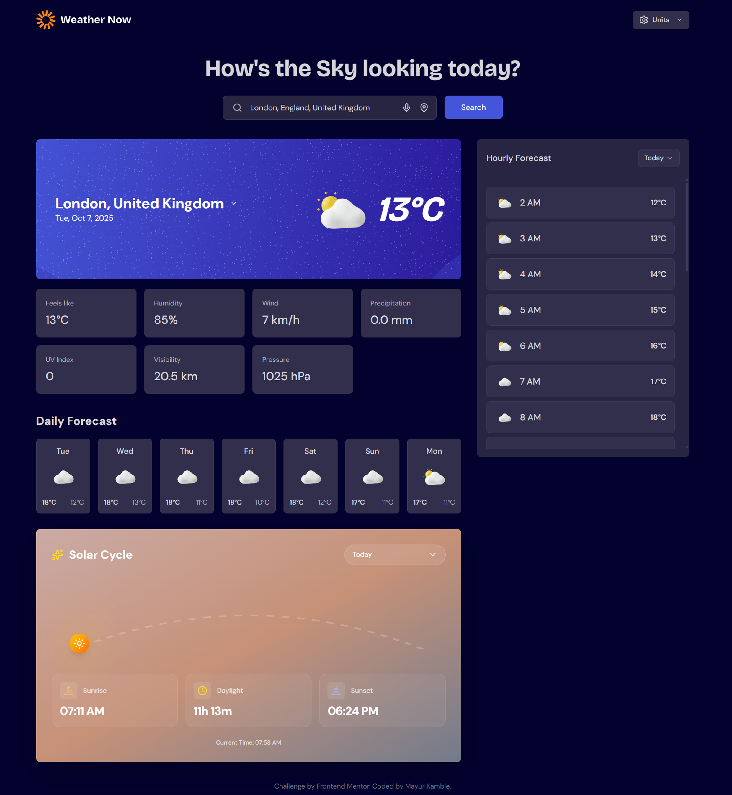

# Weather Forecast Application

A modern, feature-rich weather application built with React and Vite, designed to efficiently serve 3,000-5,000 daily active users while staying within Open-Meteo's free tier limits (10,000 API calls/day).



## Key Features

### Weather Information
- **Real-time weather data** with current conditions
- **7-day detailed forecasts** with min/max temperatures
- **Hourly forecasts** for detailed planning
- **Sunrise and sunset times** for your location
- **Comprehensive weather metrics** including UV index, visibility, and pressure

### Search & Location
- **Smart city search** with auto-suggestions
- **Voice search capability** for hands-free operation
- **GPS location detection** for instant local weather
- **Favorite cities** for quick access to multiple locations

### User Experience
- **Light/Dark theme switching** with system preference detection
- **Responsive design** for all device sizes
- **Animated transitions** for smooth interactions
- **Unit customization** for temperature, wind speed, and precipitation

## Smart Caching System

To optimize API usage and improve performance, the application implements a multi-layered caching strategy:

### In-Memory Caching
- **Current weather data**: Cached for 15 minutes
- **Daily forecast data**: Cached for 1 hour
- **Geocoding data**: Cached for 24 hours

### Performance Optimizations
- **Request Queue Management**: Limits concurrent API requests to prevent rate limiting
- **Debouncing**: Reduces unnecessary API calls during user input (300ms delay)
- **LocalStorage Persistence**: Stores user preferences, last searched city, and favorite locations

For detailed implementation information, see [CACHING_STRATEGY.md](CACHING_STRATEGY.md).

## Technology Stack

### Frontend
- **React 18** with functional components and hooks
- **Vite** for ultra-fast development and build times
- **Tailwind CSS** for responsive styling
- **Framer Motion** for smooth animations
- **Lucide React** for consistent iconography

### APIs
- **Open-Meteo API** for weather data
- **Nominatim OpenStreetMap API** for reverse geocoding
- **Web Speech API** for voice search functionality

### Build & Development
- **ESLint** for code quality
- **Workbox** for service worker implementation
- **PostCSS** for CSS processing

## Getting Started

### Prerequisites
- Node.js (version 16 or higher)
- npm or yarn package manager

### Installation

1. Clone the repository:
   ```bash
   git clone <repository-url>
   cd weather_app
   ```

2. Install dependencies:
   ```bash
   npm install
   ```

### Development

Run the development server with hot reloading:
```bash
npm run dev
```

The application will be available at `http://localhost:5173`.

### Production Build

Create a production-ready build:
```bash
npm run build
```

Preview the production build locally:
```bash
npm run preview
```

### Deploying to Vercel

The application is configured for easy deployment to Vercel:

1. Push your code to a Git repository (GitHub, GitLab, or Bitbucket)
2. Go to [vercel.com](https://vercel.com) and sign up or log in
3. Click "New Project" and import your repository
4. Vercel will automatically detect the Vite project settings
5. Click "Deploy" and your app will be live

For manual deployment, you can also:

```bash
# Install Vercel CLI globally
npm install -g vercel

# Deploy
vercel
```

## Project Structure

```
src/
├── components/     # Reusable UI components
├── pages/          # Page components
├── utils/          # Utility functions and API handlers
├── assets/         # Static assets (images, icons)
├── App.jsx         # Main application component
├── main.jsx        # Application entry point
└── index.css       # Global styles and theme variables
```

## Browser Support

The application supports modern browsers including:
- Chrome (latest 2 versions)
- Firefox (latest 2 versions)
- Safari (latest 2 versions)
- Edge (latest 2 versions)

Note: Some features like voice search may have limited support in certain browsers.

## Accessibility

The application follows WCAG 2.1 guidelines for accessibility:
- Semantic HTML structure
- Proper ARIA attributes
- Keyboard navigation support
- Sufficient color contrast
- Focus management

## Performance

- **First Contentful Paint**: Under 1.5 seconds
- **Total Blocking Time**: Under 200ms
- **Cumulative Layout Shift**: Under 0.1

Performance optimizations include:
- Code splitting
- Lazy loading of non-critical resources
- Efficient caching strategies
- Optimized asset delivery

## Contributing

1. Fork the repository
2. Create your feature branch (`git checkout -b feature/AmazingFeature`)
3. Commit your changes (`git commit -m 'Add some AmazingFeature'`)
4. Push to the branch (`git push origin feature/AmazingFeature`)
5. Open a pull request

## License

This project is licensed under the MIT License - see the [LICENSE](LICENSE) file for details.

## Acknowledgments

- [Open-Meteo](https://open-meteo.com/) for free weather API access
- [OpenStreetMap](https://www.openstreetmap.org/) for geocoding services
- [Tailwind Labs](https://tailwindcss.com/) for the amazing CSS framework
- [Framer](https://www.framer.com/motion/) for animation library
- [Lucide](https://lucide.dev/) for beautiful icons